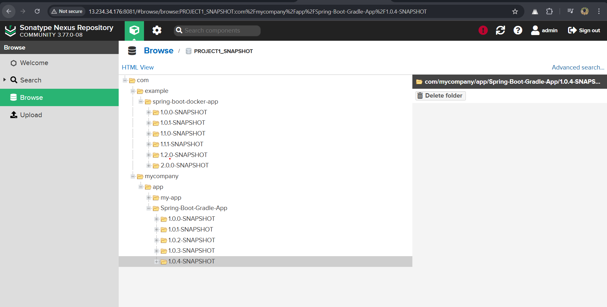

# Java DevOps CI/CD Pipeline with Jenkins, Nexus, SonarQube, and Tomcat 🚀


**Automated Build | Test | Analyze | Deploy Pipeline for Java Applications**

---

## 📋 Overview
This Jenkins pipeline automates the complete CI/CD process for Java applications, featuring:
- **Multi-build Support**: Auto-detects Maven/Gradle projects
- **Semantic Version Management**: MAJOR/MINOR/PATCH increments
- **Quality Gates**: SonarQube static code analysis
- **Artifact Handling**: Publishes to Nexus & deploys WARs to Tomcat
- **GitOps**: Auto-commits version updates to source repository
- **Notifications**: Email alerts for build status

### 📷 Pipeline Workflow


---

## 📂 Project Structure

```
|-- Java-DevOps-CI-CD/
    |-- README.md               # Main Documentation
    |-- images/                 # Directory for pipeline images/screenshots
    |-- docs/                   # Documentation directory
        |-- setup.md            # Detailed setup instructions
        |-- tools/
            |-- jenkins.md      # Jenkins setup
            |-- mail.md         # Mail setup
            |-- nexus.md        # Nexus setup
            |-- sonar.md        # SonarQube setup
            |-- tomcat.md       # Tomcat setup
        |-- pipeline_stages.md  # Combined working of all stages
    |-- pipeline.md             # Full pipeline code
    |-- LICENSE
```

---

## 🚀 Key Features
- **Dynamic Environment Setup**: Automatic JDK version detection (8/11/17/21)
- **Parallel Execution**: Concurrent deployment tasks
- **Workspace Cleanup**: Automatic resource management
- **Flexible Configuration**: Environment variable driven setup
- **Multi-Repo Support**: Works with any Git repository/branch
- **Artifact Management**: Nexus repository integration
- **Container Deployment**: Tomcat server deployment capability

### 🖥 Jenkins Pipeline UI Example


---

## ⚙️ Pipeline Stages
1. **Git Checkout**: Clones specified repository/branch
2. **Build System Detection**: Identifies Maven/Gradle project
3. **Environment Setup**: Configures JDK version
4. **Version Management**: Updates project version semantically
5. **Build & Test**: Executes build and unit tests
6. **SonarQube Analysis**: Code quality & security checks
7. **Artifact Management**:
   - WAR: Deploys to Tomcat
   - JAR: Publishes to Nexus
8. **Git Push**: Commits version updates
9. **Notifications**: Sends build status emails

🔗 **[View Combined Working of All Stages](docs/pipeline_stages.md)**

### 📊 SonarQube Code Analysis Example


---

## 🛠 Prerequisites

🔗 **[Click here for detailed setup instructions](docs/setup.md)**

### Infrastructure
- **Jenkins Server** (v2.414+)
- **Linux Slave Node** (`Slave-Node1` label)
- **SonarQube Server** (v9.9+)
- **Nexus Repository** (v3+)
- **Apache Tomcat** (v9.x)

🔧 **Tool Installations**
- **[Jenkins Setup](docs/tools/jenkins.md)**
- **[SonarQube Setup](docs/tools/sonar.md)**
- **[Nexus Setup](docs/tools/nexus.md)**
- **[Tomcat Setup](docs/tools/tomcat.md)**

### 📦 Nexus Repository UI


###  🐱 Tomcat WebApp Deployment


---

## 📄 Additional Documentation
- **[Pipeline Full Code](pipeline.md)**
- **[Setup Instructions](docs/setup.md)**
- **[Images & Screenshots](images/images.md)**
- **[Pipeline Stages Combined](docs/pipeline_stages.md)**

---

## 📧 Contact  
📧 **Email**: [sudarshangawande98@gmail.com](mailto:sudarshangawande98@gmail.com)  
🔗 **GitHub**: [Sudarshan Gawande](https://github.com/sudarshan-gawande)  
🌐 **Portfolio**: [sudarshangawande.com](https://sudarshangawande.com)  
💼 **LinkedIn**: [Sudarshan Gawande](https://www.linkedin.com/in/sudarshan-gawande/)  

---

## 📄 License
This project is licensed under the **MIT License**. See the `LICENSE` file for details.
