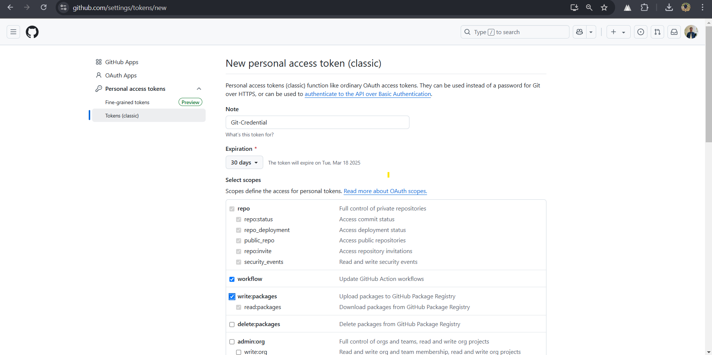
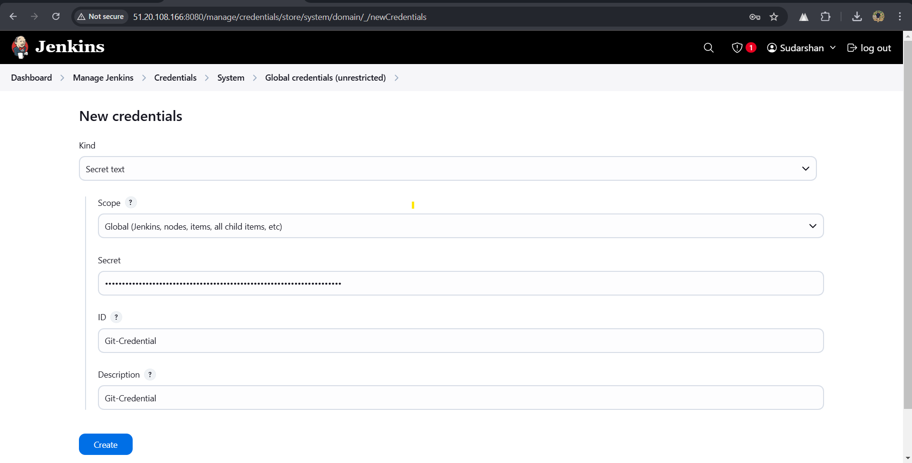

## ⚙️ Pipeline Stages

### 1️⃣ **Git Checkout**: Clones specified repository/branch
```groovy
stage('Git Checkout') {
    steps {
        checkout scm: [
            $class: 'GitSCM',
            branches: [[name: params.GIT_BRANCH]],
            extensions: [],
            userRemoteConfigs: [[url: params.GIT_URL]]
        ]
    }
}
```

### 2️⃣ **Build System Detection**: Identifies Maven/Gradle project
```groovy
stage('Detect Build System & Artifact Type') {
    steps {
        script {
            if (fileExists('pom.xml')) {
                env.BUILD_TOOL = 'maven'
                sh "mvn clean package"

                env.PACKAGING_TYPE = sh(
                    script: "mvn help:evaluate -Dexpression=project.packaging -q -DforceStdout", 
                    returnStdout: true
                ).trim().toLowerCase()

                env.GROUP_ID = sh(
                    script: "mvn help:evaluate -Dexpression=project.groupId -q -DforceStdout", 
                    returnStdout: true
                ).trim()
                env.PROJECT_NAME = sh(
                    script: "mvn help:evaluate -Dexpression=project.artifactId -q -DforceStdout", 
                    returnStdout: true
                ).trim()
                env.PROJECT_VERSION = sh(
                    script: "mvn help:evaluate -Dexpression=project.version -q -DforceStdout", 
                    returnStdout: true
                ).trim()

                if (env.PACKAGING_TYPE == 'war') {
                    env.ARTIFACT_PATH = sh(script: "ls target/*.war 2>/dev/null | head -1", returnStdout: true).trim()
                } else {
                    env.ARTIFACT_PATH = sh(script: "ls target/*.jar 2>/dev/null | grep -v original | head -1", returnStdout: true).trim()
                }
                env.ARTIFACT_TYPE = env.PACKAGING_TYPE

            } else if (fileExists('build.gradle')) {
                env.BUILD_TOOL = 'gradle'
                sh "chmod +x gradlew && ./gradlew clean build"
            
                env.PROJECT_NAME = sh(
                    script: "grep '^rootProject.name' settings.gradle | cut -d '=' -f2 | tr -d \"'\"", 
                    returnStdout: true
                ).trim()
            
                env.PROJECT_VERSION = sh(
                    script: "grep '^version' build.gradle | head -1 | cut -d '=' -f2 | tr -d \"'\" | tr -d ' '",
                    returnStdout: true
                ).trim()
            
                env.GROUP_ID = sh(
                    script: "grep '^group' build.gradle | head -1 | cut -d '=' -f2 | tr -d \"'\"", 
                    returnStdout: true
                ).trim()
            
                // Identify correct WAR file (excluding "-plain")
                def gradleWarFile = sh(script: "ls build/libs/*.war 2>/dev/null | grep -v plain | head -1", returnStdout: true).trim()
                def gradleJarFile = sh(script: "ls build/libs/*.jar 2>/dev/null | grep -v original | head -1", returnStdout: true).trim()
            
                if (gradleWarFile) {
                    env.ARTIFACT_TYPE = 'war'
                    env.ARTIFACT_PATH = gradleWarFile
                } else {
                    env.ARTIFACT_TYPE = 'jar'
                    env.ARTIFACT_PATH = gradleJarFile
                }
            }

            echo """
            Detected Project Details:
            - Build Tool: ${env.BUILD_TOOL}
            - Group ID: ${env.GROUP_ID}
            - Artifact ID: ${env.PROJECT_NAME}
            - Version: ${env.PROJECT_VERSION}
            - Artifact Type: ${env.ARTIFACT_TYPE}
            - Artifact Path: ${env.ARTIFACT_PATH}
            """
        }
    }
}

```

### 3️⃣ **Environment Setup**: Configures JDK version
```groovy
stage('Setup Environment') {
    steps {
        script {
            // Detect JDK Version from Build Files
            if (fileExists('pom.xml')) {
                env.JAVA_VERSION = sh(
                    script: "mvn help:evaluate -Dexpression=maven.compiler.source -q -DforceStdout | cut -d '.' -f2",
                    returnStdout: true
                ).trim()
            } else if (fileExists('build.gradle')) {
                env.JAVA_VERSION = sh(
                    script: """
                    grep 'sourceCompatibility' build.gradle | sed -E "s/[^0-9]*([0-9]+).*/\\1/" | head -1
                    """,
                    returnStdout: true
                ).trim()
            }

            // Ensure JAVA_HOME is properly set based on JAVA_VERSION
            def javaHomeMap = [
                "8": env.JAVA_8_HOME,
                "11": env.JAVA_11_HOME,
                "17": env.JAVA_17_HOME,
                "21": env.JAVA_21_HOME
            ]

            if (javaHomeMap.containsKey(env.JAVA_VERSION)) {
                env.JAVA_HOME = javaHomeMap[env.JAVA_VERSION]
            } else {
                error "❌ Unsupported Java version detected: ${env.JAVA_VERSION}"
            }

            sh """
            export JAVA_HOME=${env.JAVA_HOME}
            export PATH=${env.JAVA_HOME}/bin:${env.PATH}
            echo "✅ JAVA_HOME is now set to ${env.JAVA_HOME}"
            """

            echo "✅ Using Java ${env.JAVA_VERSION} from ${env.JAVA_HOME}"
        }
    }
}
```

### 4️⃣ **Version Management**: Updates project version semantically

## 🔥 Configuring GitHub Credentials for Jenkins

**Note:** This step is required only if you are pushing an updated version to Git (Versioning).

### **1. Generate a GitHub Personal Access Token**
- Go to [GitHub Personal Access Tokens](https://github.com/settings/tokens/new)
- Select **Tokens (classic)**.
- Provide a **Note** (e.g., `Git-Credential`).
- Set **Expiration** (e.g., `30 days`).
- Enable the following scopes:
  - `repo` (Full control of private repositories)
  - `workflow` (GitHub Actions access)
  - `write:packages`, `read:packages`
  - `admin:public_key`, `read:public_key`
- Click **Generate Token** and copy the token.



### **2. Add GitHub Token to Jenkins Credentials**
- In **Jenkins UI**:
  - Go to **Manage Jenkins** → **Manage Credentials**.
  - Select **Global credentials (unrestricted)**.
  - Click **Add Credentials**.
  - Choose **Secret text**.
  - Enter **ID** (e.g., `Git-Credential`).
  - Paste the **GitHub Token** in the **Secret** field.
  - Click **Create**.



---
### **3. Git Commit and Push Version Update**
This step ensures that versioning is managed correctly when pushing to the repository.
```groovy
stage('Version Management') {
    steps {
        script {
            // Remove '-SNAPSHOT' if present
            def cleanVersion = env.PROJECT_VERSION.replace("-SNAPSHOT", "").trim()
            
            def versionParts = cleanVersion.tokenize('.')
            if (versionParts.size() < 3) {
                error "❌ Invalid version format: ${env.PROJECT_VERSION}"
            }

            def major = versionParts[0].toInteger()
            def minor = versionParts[1].toInteger()
            def patch = versionParts[2].toInteger()

            if (params.VERSION_INCREMENT == "MAJOR") {
                major += 1
                minor = 0
                patch = 0
            } else if (params.VERSION_INCREMENT == "MINOR") {
                minor += 1
                patch = 0
            } else if (params.VERSION_INCREMENT == "PATCH") {
                patch += 1
            }

            env.NEW_VERSION = "${major}.${minor}.${patch}-SNAPSHOT"
            echo "🔄 Updating Version to: ${env.NEW_VERSION}"

            // Update version in the project files
            if (env.BUILD_TOOL == 'maven') {
                sh "mvn versions:set -DnewVersion=${env.NEW_VERSION} -q"
                sh "mvn versions:commit -q"
            } else {
                sh "sed -i \"s/version = .*/version = '${env.NEW_VERSION}'/\" build.gradle"
            }
        }
    }
}
```

### 5️⃣ **Build & Test**: Executes build and unit tests
```groovy
stage('Build & Test') {
    steps {
        script {
            timeout(time: 15, unit: 'MINUTES') {
                if (env.BUILD_TOOL == 'maven') {
                    sh "mvn clean package"

                    // Extract version dynamically from pom.xml
                    env.PROJECT_VERSION = sh(
                        script: "mvn help:evaluate -Dexpression=project.version -q -DforceStdout",
                        returnStdout: true
                    ).trim()

                    // Detect actual generated JAR (Spring Boot replaces default JAR)
                    env.EXPECTED_JAR = sh(
                        script: "ls target/*.jar 2>/dev/null | grep -v original | head -1",
                        returnStdout: true
                    ).trim()

                    // Ensure the expected JAR file exists
                    if (!fileExists(env.EXPECTED_JAR)) {
                        error "❌ Build failed! Expected JAR file not found: ${env.EXPECTED_JAR}"
                    }

                    echo "✅ Build successful! Artifact generated: ${env.EXPECTED_JAR}"
                } else {
                    sh "./gradlew clean build"

                    // Extract version dynamically from Gradle
                    env.PROJECT_VERSION = sh(
                        script: "grep '^version' build.gradle | head -1 | cut -d '=' -f2 | tr -d \"'\"",
                        returnStdout: true
                    ).trim()

                    // Detect actual generated JAR
                    env.EXPECTED_JAR = sh(
                        script: "ls build/libs/*.jar 2>/dev/null | grep -v original | head -1",
                        returnStdout: true
                    ).trim()

                    // Ensure the expected JAR file exists
                    if (!fileExists(env.EXPECTED_JAR)) {
                        error "❌ Build failed! Expected JAR file not found: ${env.EXPECTED_JAR}"
                    }

                    echo "✅ Build successful! Artifact generated: ${env.EXPECTED_JAR}"
                }
            }
        }
    }
}
```

### 6️⃣ **SonarQube Analysis**: Code quality & security checks
```groovy
stage('SonarQube Analysis') {
    steps {
        script {
            withSonarQubeEnv(env.SONARQUBE_ENV) {
                if (env.BUILD_TOOL == 'maven') {
                    sh """
                    sonar-scanner \
                        -Dsonar.projectKey=${env.GROUP_ID}:${env.PROJECT_NAME} \
                        -Dsonar.projectName=${env.PROJECT_NAME} \
                        -Dsonar.projectVersion=${env.PROJECT_VERSION} \
                        -Dsonar.sources=src/main/java \
                        -Dsonar.java.binaries=target/classes \
                        -Dsonar.coverage.jacoco.xmlReportPaths=target/site/jacoco/jacoco.xml
                    """
                } else {
                    sh """
                    sonar-scanner \
                        -Dsonar.projectKey=${env.GROUP_ID}:${env.PROJECT_NAME} \
                        -Dsonar.projectName=${env.PROJECT_NAME} \
                        -Dsonar.projectVersion=${env.PROJECT_VERSION} \
                        -Dsonar.sources=src/main/java \
                        -Dsonar.java.binaries=build/classes/java/main \
                        -Dsonar.coverage.jacoco.xmlReportPaths=build/reports/jacoco/test/jacocoTestReport.xml
                    """
                }
            }
        }
    }
}
```

### 7️⃣ **Artifact Management**:

#### 📦 Deploy WAR to Tomcat
```groovy
stage('Deploy to Tomcat') {
    when { expression { return env.ARTIFACT_TYPE == 'war' } }
    steps {
        script {
            if (env.BUILD_TOOL == 'maven') {
                env.WAR_FILE_PATH = "target/${env.PROJECT_NAME}-${env.PROJECT_VERSION}.war"
            } else {
                env.WAR_FILE_PATH = "build/libs/${env.PROJECT_NAME}-${env.PROJECT_VERSION}.war"
            }

            if (!fileExists(env.WAR_FILE_PATH)) {
                error "❌ WAR file does not exist: ${env.WAR_FILE_PATH}"
            }

            deploy adapters: [tomcat9(
                credentialsId: env.TOMCAT_CREDENTIAL_ID,
                url: env.TOMCAT_URL
            )],
            contextPath: env.PROJECT_NAME,
            war: env.WAR_FILE_PATH
        }
    }
}
```

#### 📦 Publish JAR to Nexus
```groovy
stage('Publish to Nexus') {
    steps {
        script {
            if (env.ARTIFACT_TYPE == 'war') {
                if (env.BUILD_TOOL == 'maven') {
                    env.ARTIFACT_PATH = "target/${env.PROJECT_NAME}-${env.PROJECT_VERSION}.war"
                } else {
                    env.ARTIFACT_PATH = "build/libs/${env.PROJECT_NAME}-${env.PROJECT_VERSION}.war"
                }
            } else {
                if (env.BUILD_TOOL == 'maven') {
                    env.ARTIFACT_PATH = "target/${env.PROJECT_NAME}-${env.PROJECT_VERSION}.jar"
                } else {
                    env.ARTIFACT_PATH = "build/libs/${env.PROJECT_NAME}-${env.PROJECT_VERSION}.jar"
                }
            }

            if (!fileExists(env.ARTIFACT_PATH)) {
                error "❌ Artifact file does not exist: ${env.ARTIFACT_PATH}"
            }

            withCredentials([usernamePassword(
                credentialsId: env.NEXUS_CREDENTIAL_ID,
                usernameVariable: 'NEXUS_USER',
                passwordVariable: 'NEXUS_PASSWORD'
            )]) {
                nexusArtifactUploader(
                    nexusVersion: 'nexus3',
                    protocol: 'http',
                    nexusUrl: env.NEXUS_URL,
                    groupId: env.GROUP_ID,
                    version: env.PROJECT_VERSION,
                    repository: env.NEXUS_REPOSITORY,
                    credentialsId: env.NEXUS_CREDENTIAL_ID,
                    artifacts: [
                        [artifactId: env.PROJECT_NAME, 
                            classifier: '', 
                            file: env.ARTIFACT_PATH, 
                            type: env.ARTIFACT_TYPE]
                    ]
                )
            }
        }
    }
}
```

### 8️⃣ **Git Push**: Commits version updates
```groovy
stage('Push Updated Version to Git') {
    steps {
        script {
            withCredentials([string(credentialsId: env.GIT_CREDENTIAL_ID, variable: 'GIT_TOKEN')]) {
                sh """
                set -e  # Stop on error

                # Configure Git user
                git config --global user.email "${env.GIT_USER_EMAIL}"
                git config --global user.name "${env.GIT_USER_NAME}"

                # Identify the correct build file (Maven or Gradle)
                if [ -f "pom.xml" ]; then
                    BUILD_FILE="pom.xml"
                elif [ -f "build.gradle" ]; then
                    BUILD_FILE="build.gradle"
                else
                    echo "❌ No Maven (pom.xml) or Gradle (build.gradle) file found. Exiting."
                    exit 1
                fi

                # Stash any local changes to prevent conflicts
                git stash push -m "Jenkins Auto Stash" || true

                # Fetch latest changes from remote
                git fetch origin ${params.GIT_BRANCH}

                # Checkout the branch properly
                git checkout ${params.GIT_BRANCH} || git checkout -b ${params.GIT_BRANCH}

                # Pull latest changes with rebase (avoids unnecessary merge commits)
                git pull --rebase origin ${params.GIT_BRANCH} || true

                # Apply stashed changes (if any)
                git stash pop || echo "No stashed changes to apply"

                # Stage and commit the version update
                git add \$BUILD_FILE

                if git diff --cached --exit-code; then
                    echo "✅ No version change detected, skipping commit."
                else
                    git commit -m "🔄 Auto-update version to ${env.NEW_VERSION}"
                fi

                # Resolve merge conflicts in pom.xml if they exist
                if git diff --name-only --diff-filter=U | grep -q "pom.xml"; then
                    echo "❌ Merge conflict detected in pom.xml, resolving..."
                    git checkout --theirs pom.xml
                    git add pom.xml
                    git commit -m "✅ Resolved merge conflict in pom.xml"
                fi

                # Construct authenticated URL for Git push
                REPO_URL=\$(echo "${params.GIT_URL}" | sed "s#https://#https://x-access-token:${GIT_TOKEN}@#")

                # Push changes safely (handle fast-forward issues)
                git push "\$REPO_URL" ${params.GIT_BRANCH} || (git pull --rebase origin ${params.GIT_BRANCH} && git push "\$REPO_URL" ${params.GIT_BRANCH})
                """
            }
        }
    }
}
```

### 9️⃣ **Notifications**: Sends build status emails
```groovy
post {
    success {
        emailext(
            subject: "SUCCESS: Build ${env.JOB_NAME} #${env.BUILD_NUMBER}",
            body: """
            <p>Hi Team,</p>
            <p>The Jenkins pipeline <b>${env.JOB_NAME}</b> build <b>#${env.BUILD_NUMBER}</b> has succeeded.</p>
            <p>Details:</p>
            <ul>
                <li>Project: ${env.JOB_NAME}</li>
                <li>Build Number: ${env.BUILD_NUMBER}</li>
                <li>Status: SUCCESS</li>
                <li>Duration: ${currentBuild.durationString}</li>
                <li>View Build: <a href="${env.BUILD_URL}">${env.BUILD_URL}</a></li>
            </ul>
            <p>Regards,<br>Jenkins</p>
            """,
            mimeType: 'text/html',
            to: env.EMAIL_RECIPIENTS
        )
    }

    failure {
        emailext(
            subject: "FAILURE: Build ${env.JOB_NAME} #${env.BUILD_NUMBER}",
            body: """
            <p>Hi Team,</p>
            <p>The Jenkins pipeline <b>${env.JOB_NAME}</b> build <b>#${env.BUILD_NUMBER}</b> has failed.</p>
            <p>Details:</p>
            <ul>
                <li>Project: ${env.JOB_NAME}</li>
                <li>Build Number: ${env.BUILD_NUMBER}</li>
                <li>Status: FAILURE</li>
                <li>Duration: ${currentBuild.durationString}</li>
                <li>View Build: <a href="${env.BUILD_URL}">${env.BUILD_URL}</a></li>
            </ul>
            <p>Please investigate the issue.</p>
            <p>Regards,<br>Jenkins</p>
            """,
            mimeType: 'text/html',
            to: env.EMAIL_RECIPIENTS
        )
    }

    always {
        script {
            sh """
            find . -not -name '.git' -not -name '.gitignore' -not -path './.git/*' -delete
            """
        }
        cleanWs()
    }
}

```

