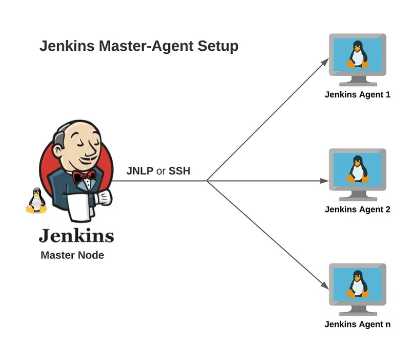
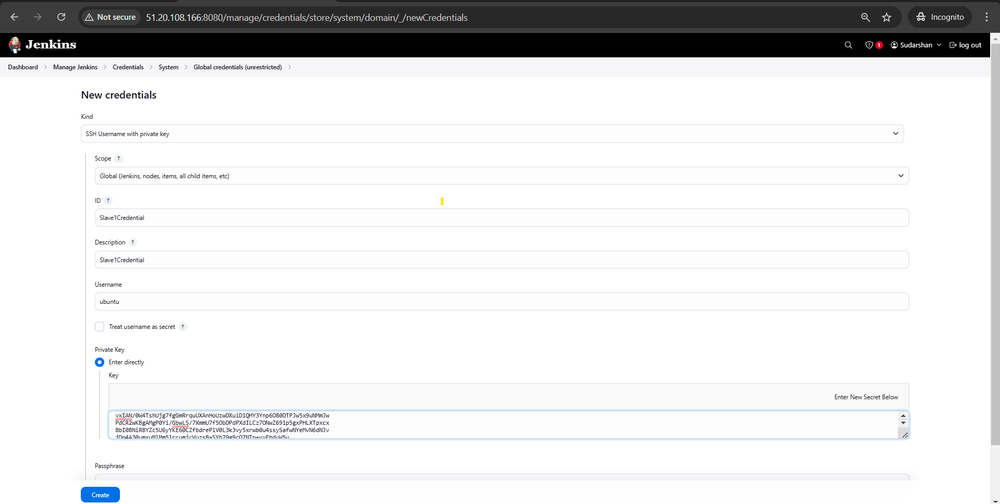
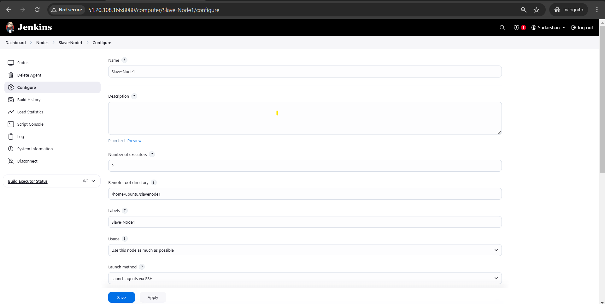
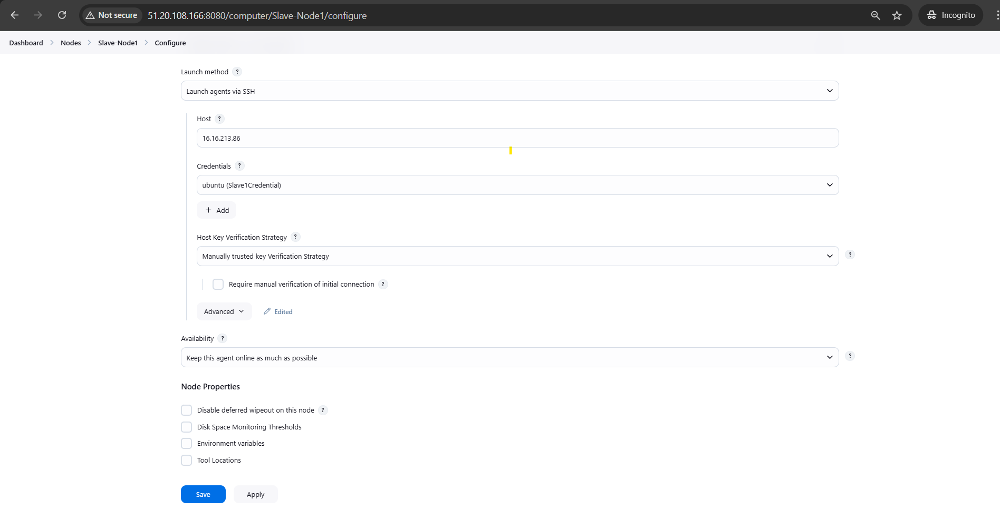

# Jenkins Master-Slave Setup Guide 🚀

## 📋 Overview
This document provides a step-by-step guide to setting up **Jenkins** with a **master-slave architecture** for efficient CI/CD automation. It includes required software installations, configurations, and best practices for a production-ready Jenkins environment.

---

## 🏛️ Architecture Diagram



---

## 📌 Prerequisites

### ✅ System Requirements
- **Jenkins Master**: A RHEL 8/9 machine to run Jenkins.
- **Jenkins Slaves**: Separate RHEL 8/9 machines to execute builds.
- **Instance Type**: Use **t3.medium** for Jenkins Slave nodes (t3.micro is not sufficient).
- **Security Group Configuration**:
  - Allow **Port 8080** for Jenkins UI on the Master.
  - Allow **Port 22** for SSH access (for Jenkins Slave Nodes and remote administration).
  - Allow **Port 50000** for Jenkins Agent Communication between Master and Slaves.

### ✅ Required Software
- **Jenkins (LTS Version) installed on Master**
- **Java 21 installed on both Master and Slaves**
- **Maven & Gradle** (for Java builds, installed on both Master and Slaves)
- **Git** (for source code versioning, installed on both Master and Slaves)
- **Docker** (optional, for containerized builds)
- **SonarQube Scanner** (for code analysis)
- **Nexus CLI** (for artifact management)

---

## 🔧 Jenkins Master Setup

### **1⃣ Install Java 21**
```bash
sudo yum update -y
sudo yum install -y java-21-openjdk java-21-openjdk-devel
java -version
```

### **2⃣ Install Jenkins (for RHEL 8/9)**
```bash
# Add the Jenkins repository
sudo wget -O /etc/yum.repos.d/jenkins.repo \
    https://pkg.jenkins.io/rpm-stable/jenkins.repo

# Upgrade system packages
sudo yum upgrade -y

# Add required dependencies for the jenkins package
sudo yum install -y fontconfig java-21-openjdk

# Install Jenkins
sudo yum install -y jenkins

# Reload systemd daemon
sudo systemctl daemon-reload

# Start Jenkins service
sudo systemctl start jenkins

# Enable Jenkins to start on boot
sudo systemctl enable jenkins

# Check Jenkins status
sudo systemctl status jenkins
```

### **3⃣ Setup Firewall Rules (If Required)**
```bash
sudo firewall-cmd --permanent --add-port=8080/tcp
sudo firewall-cmd --permanent --add-port=22/tcp
sudo firewall-cmd --permanent --add-port=50000/tcp
sudo firewall-cmd --reload
```

### **4⃣ Get Jenkins Admin Password**
```bash
sudo cat /var/lib/jenkins/secrets/initialAdminPassword
```

- Access **Jenkins UI**: `http://<JENKINS_MASTER_IP>:8080`
- Enter the **Admin Password**.
- Install recommended plugins.

---

## 🔧 Jenkins Slave Node Setup

### **1. Install Java 21**
```bash
sudo yum update -y
sudo yum install -y fontconfig java-21-openjdk
java -version
```

### **2. Create Jenkins User (if not exists)**
```bash
sudo useradd -m -s /bin/bash jenkins
sudo usermod -aG wheel jenkins
```

### **3. Configure SSH Credentials for Slave Node**
- In **Jenkins UI**:
  - Go to **Manage Jenkins** → **Manage Credentials**.
  - Select **Global credentials (unrestricted)**.
  - Click **Add Credentials**.
  - Choose **SSH Username with Private Key**.
  - Enter **ID** (e.g., `Slave1Credential`).
  - Enter **Description** (e.g., `Slave1Credential`).
  - Enter **Username** (e.g., `ec2-user`).
  - Select **Enter Directly** for Private Key.
  - Paste the contents of the .pem file (e.g., jenkins-slave.pem).
  - Click **Add** to save credentials.



### **4. Configure Jenkins Master to Recognize Slave**
- In **Jenkins UI**:
  - Go to **Manage Jenkins** → **Manage Nodes and Clouds**.
  - Click **New Node** → Enter Slave Name (e.g., Slave-Node1)
  - Choose **Permanent Agent**.
  - Enter **Name** (e.g., Slave-Node1). 
  - Enter **Number of executors** (Define the number of executors (2) for parallel job execution.).  
  - Set Remote Root Directory (`/home/ec2-user/slavenode1`).
  - Choose **Launch method: SSH**.
  - Enter **Slave's Public IP & Select SSH credentials** (created in Step 3).
  - Select **Manually Trusted Key Verification Strategy**.
  - Set Availability to **Keep this agent online as much as possible**.
  - Save & Test Connection.





---

## 🔥 Installing Required Plugins

### **Recommended Jenkins Plugins**
Install via Jenkins UI:
- **Git Plugin**
- **Pipeline Plugin**
- **Pipeline: Stage View Plugin**
- **SonarQube Scanner Plugin**
- **Nexus Artifact Uploader**
- **Docker Plugin** (if using Docker)
- **SSH Build Agents** (for slave nodes)

**To install plugins via Jenkins UI:**
1. Go to **Manage Jenkins** → **Manage Plugins**.
2. Click **Available plugins** tab.
3. Search for the plugin name and check the checkbox.
4. Click **Install without restart**.

---

## 🏁 Final Verification

### ✅ **Jenkins Master**
- Jenkins UI is accessible at `http://<JENKINS_MASTER_IP>:8080`
- Slave nodes are successfully connected.
- Required plugins are installed.

### ✅ **Jenkins Slave Nodes**
- Slave agents are running.
- Slave can execute build jobs.


---

## 📄 Additional Documentation
- **[Jenkins Official Docs](https://www.jenkins.io/doc/)**
- **[Jenkins with AWS CodeDeploy](https://docs.aws.amazon.com/codedeploy/latest/userguide/integrating-jenkins-with-codedeploy.html)**

---

## 📧 Contact  
📧 **Email**: [sudarshangawande98@gmail.com](mailto:sudarshangawande98@gmail.com)  
🔗 **GitHub**: [Sudarshan Gawande](https://github.com/sudarshan-gawande)  
🌐 **Portfolio**: [sudarshangawande.com](https://sudarshangawande.com)  
💼 **LinkedIn**: [Sudarshan Gawande](https://www.linkedin.com/in/sudarshan-gawande/)  

---

## 📄 License
This project is licensed under the **MIT License**. See the `LICENSE` file for details.