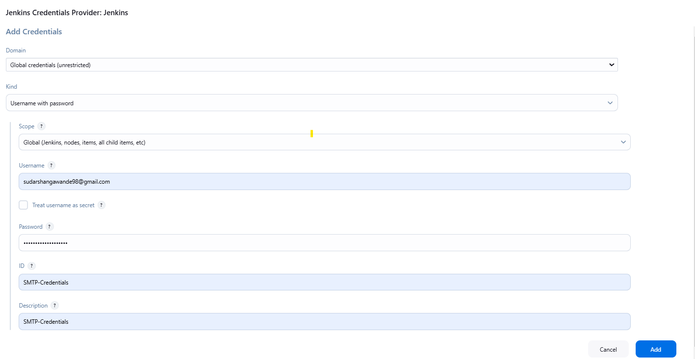
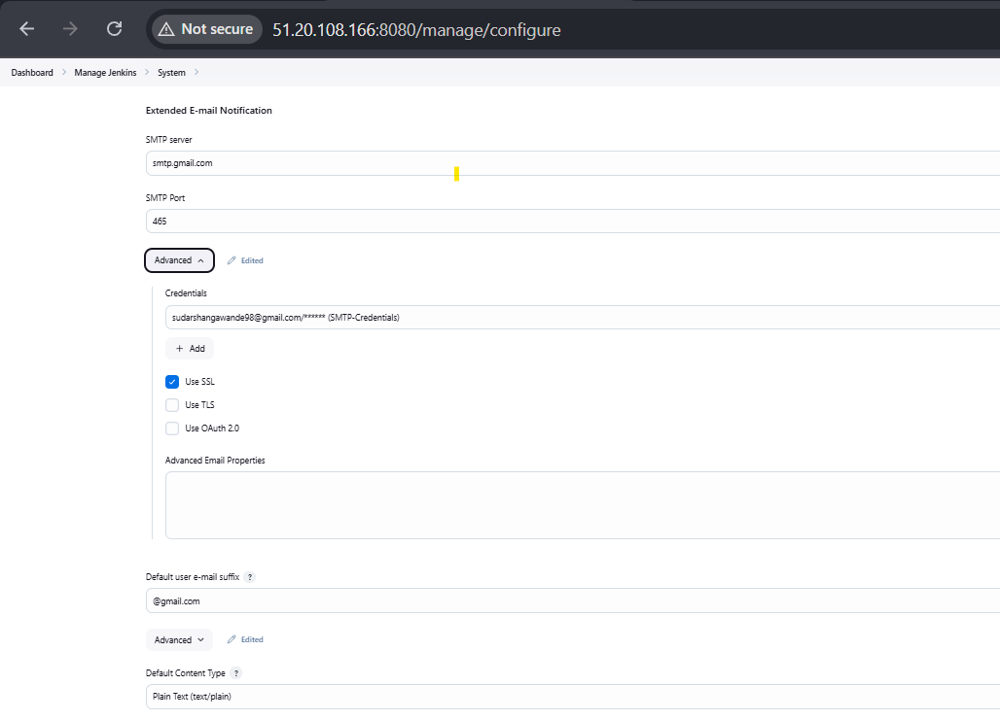
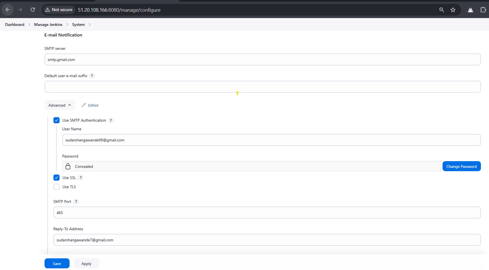

# Jenkins Email Notification Setup 📧

## Overview 🚀
This guide provides step-by-step instructions on configuring **Email Notification** in **Jenkins** using an SMTP server.

---

## 📌 Prerequisites
- Jenkins installed and running
- SMTP server details (e.g., Gmail, Outlook, or an enterprise SMTP server)
- A valid email account with SMTP authentication

---

## 📧 Configure SMTP Settings in Jenkins

### **1️⃣ Add SMTP Credentials in Jenkins**
1. Navigate to **Manage Jenkins** → **Manage Credentials**.
2. Select **Global credentials (unrestricted)**.
3. Click **Add Credentials**.
4. Choose **Kind: Username with password**.
5. Fill in:
   - **Username**: Your SMTP email (e.g., `sudarshangawande98@gmail.com`).
   - **Password**: The app password or SMTP authentication password.
   - **ID**: `SMTP-Credentials`
   - **Description**: `SMTP-Credentials`
6. Click **Create**.

### 📌 **(Reference Image)**


---

### **2️⃣ Configure Extended E-mail Notification Plugin**
1. Go to **Manage Jenkins** → **System Configuration**.
2. Locate **Extended E-mail Notification**.
3. Set the following details:
   - **SMTP Server**: `smtp.gmail.com`
   - **SMTP Port**: `465`
   - **Use SSL**: ✅ (Checked)
   - **Credentials**: Select **SMTP-Credentials** from the dropdown.
4. Click **Save**.

### 📌 **(Reference Image)**


---

### **3️⃣ Configure Default Email Notification in Jenkins**
1. Go to **Manage Jenkins** → **Configure System**.
2. Locate **E-mail Notification** section.
3. Set the following:
   - **SMTP Server**: `smtp.gmail.com`
   - **Use SMTP Authentication**: ✅ (Checked)
   - **User Name**: Your email address (e.g., `sudarshangawande98@gmail.com`)
   - **Password**: The app password
   - **Use SSL**: ✅ (Checked)
   - **SMTP Port**: `465`
   - **Reply-To Address**: `your-email@gmail.com`
   - **Charset**: `UTF-8`
4. Click **Save**.

### 📌 **(Reference Image)**


---

## 🏗️ **Test Email Notification in Jenkins**
1. In **Manage Jenkins** → **Configure System**, go to the **E-mail Notification** section.
2. Scroll down and find **Test configuration by sending test e-mail**.
3. Enter a valid email address.
4. Click **Test** to verify the configuration.

---

## 📝 **Using Email Notification in Jenkins Pipeline**

### **Declarative Pipeline Example**
```groovy
post {
    success {
        emailext(
            subject: "SUCCESS: Build ${env.JOB_NAME} #${env.BUILD_NUMBER}",
            body: """
            <p>Hi Team,</p>
            <p>The Jenkins pipeline <b>${env.JOB_NAME}</b> build <b>#${env.BUILD_NUMBER}</b> has succeeded.</p>
            <p>Details:</p>
            <ul>
                <li>Project: ${env.JOB_NAME}</li>
                <li>Build Number: ${env.BUILD_NUMBER}</li>
                <li>Status: SUCCESS</li>
                <li>Duration: ${currentBuild.durationString}</li>
                <li>View Build: <a href="${env.BUILD_URL}">${env.BUILD_URL}</a></li>
            </ul>
            <p>Regards,<br>Jenkins</p>
            """,
            mimeType: 'text/html',
            to: env.EMAIL_RECIPIENTS
        )
    }

    failure {
        emailext(
            subject: "FAILURE: Build ${env.JOB_NAME} #${env.BUILD_NUMBER}",
            body: """
            <p>Hi Team,</p>
            <p>The Jenkins pipeline <b>${env.JOB_NAME}</b> build <b>#${env.BUILD_NUMBER}</b> has failed.</p>
            <p>Details:</p>
            <ul>
                <li>Project: ${env.JOB_NAME}</li>
                <li>Build Number: ${env.BUILD_NUMBER}</li>
                <li>Status: FAILURE</li>
                <li>Duration: ${currentBuild.durationString}</li>
                <li>View Build: <a href="${env.BUILD_URL}">${env.BUILD_URL}</a></li>
            </ul>
            <p>Please investigate the issue.</p>
            <p>Regards,<br>Jenkins</p>
            """,
            mimeType: 'text/html',
            to: env.EMAIL_RECIPIENTS
        )
    }

    always {
        script {
            sh """
            find . -not -name '.git' -not -name '.gitignore' -not -path './.git/*' -delete
            """
        }
        cleanWs()
    }
}

```

---

## ✅ **Final Verification**
- Ensure test email notifications work correctly.
- Validate Jenkins jobs send email notifications upon success or failure.

## 📄 Additional Resources
- **[Jenkins Email Extension Plugin](https://plugins.jenkins.io/email-ext/)**
- **[Jenkins Documentation](https://www.jenkins.io/doc/)**

---

## 🔗 **Contact**
📧 **Email**: [sudarshangawande98@gmail.com](mailto:sudarshangawande98@gmail.com)  
📎 **GitHub**: [Sudarshan Gawande](https://github.com/sudarshangawande98)

