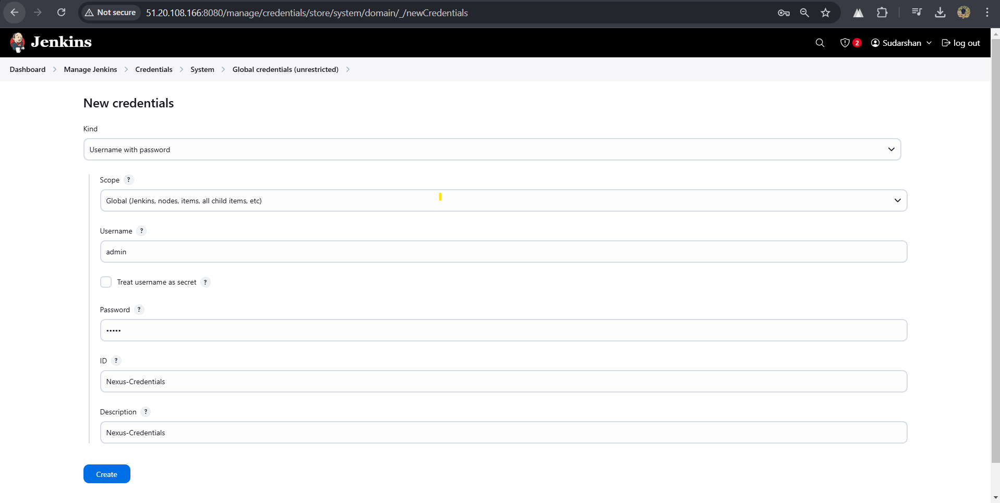

# Nexus Repository Setup Guide for Amazon EC2 & Jenkins Integration 🚀

## 📋 Overview
Nexus Repository is a powerful artifact management tool that allows you to store, manage, and retrieve artifacts such as JARs, WARs, and dependencies for your projects. This guide provides a step-by-step setup on how to install Nexus on an Amazon EC2 instance, configure it for Jenkins, and use it as a dependency manager.

---

## 📌 Prerequisites

### ✅ System Requirements
- **Amazon EC2 Instance** (Ubuntu 22.04 recommended)
- **Minimum 4GB RAM (8GB recommended)**
- **Java 17+ Installed**
- **Jenkins Installed and Running**
- **Maven Installed for Dependency Management**

---

## 🔧 Install Nexus Repository on EC2

### **1️⃣ Install Java 17**
```bash
sudo apt update
sudo apt install -y openjdk-17-jdk
java -version
```

### **2️⃣ Download and Install Nexus**
```bash
cd /opt
sudo apt install wget
sudo wget https://download.sonatype.com/nexus/3/latest-unix.tar.gz
sudo tar -xvf latest-unix.tar.gz
sudo mv nexus-* nexus
```

### **3️⃣ Create a Dedicated Nexus User**
```bash
sudo useradd -r -d /opt/nexus -s /bin/false nexus
sudo chown -R nexus:nexus /opt/nexus
sudo chown -R nexus:nexus /opt/sonatype-work
sudo chmod -R 755 /opt/sonatype-work
```

### **4️⃣ Configure Nexus as a Service**
Edit the Nexus startup script:
```bash
sudo nano /opt/nexus/bin/nexus.rc
```
Add the following line:
```bash
run_as_user="nexus"
```
Save and exit (`CTRL+X`, then `Y`, then `Enter`).

### **5️⃣ Create a Systemd Service for Nexus**
```bash
sudo nano /etc/systemd/system/nexus.service
```
Paste the following content:
```ini
[Unit]
Description=Nexus Repository Manager
After=network.target

[Service]
Type=forking
User=nexus
Group=nexus
ExecStart=/opt/nexus/bin/nexus start
ExecStop=/opt/nexus/bin/nexus stop
Restart=on-abort

[Install]
WantedBy=multi-user.target
```

### **6️⃣ Start and Enable Nexus Service**
```bash
sudo systemctl daemon-reload
sudo systemctl enable nexus
sudo systemctl start nexus
sudo systemctl status nexus
```

---

## ✅ Access Nexus Web Interface

Once the service is running, open your browser and navigate to:
```
http://<EC2_PUBLIC_IP>:8081
```
- **Default Login Credentials:**
  - **Username:** `admin`
  - **Password:** Found in `/opt/nexus/sonatype-work/nexus3/admin.password`  
    ```bash
    sudo cat /opt/sonatype-work/nexus3/admin.password
    ```
  - Change the default password after the first login.


---

## 🔧 Configure Nexus for Jenkins & Maven

### **1️⃣ Create a Maven Repository**
- Login to Nexus UI → **Repositories** → **Create repository**  
- Select **hosted Maven repository**
- Set **Name** (e.g., `maven-project1-snapshot`)
- Set **Version Policy** to `Snapshot`
- Click **Create Repository**

### **2️⃣ Add Nexus to Maven Settings**
Edit the Maven settings file:
```bash
nano ~/.m2/settings.xml
```
Add the following:
```xml
<settings xmlns="http://maven.apache.org/SETTINGS/1.0.0"
          xmlns:xsi="http://www.w3.org/2001/XMLSchema-instance"
          xsi:schemaLocation="http://maven.apache.org/SETTINGS/1.0.0 http://maven.apache.org/xsd/settings-1.0.0.xsd">

  <servers>
    <server>
      <id>nexus</id>
      <username>admin</username>
      <password>admin</password>
    </server>
  </servers>

  <mirrors>
    <mirror>
      <id>nexus</id>
      <mirrorOf>*</mirrorOf>
      <url>http://13.48.55.59:8081/repository/maven-public/</url>
    </mirror>
  </mirrors>

  <profiles>
    <profile>
      <id>nexus</id>
      <repositories>
        <repository>
          <id>nexus-releases</id>
          <url>http://13.48.55.59:8081/repository/maven-releases/</url>
          <releases>
            <enabled>true</enabled>
          </releases>
          <snapshots>
            <enabled>false</enabled>
          </snapshots>
        </repository>
        <repository>
          <id>nexus-snapshots</id>
          <url>http://13.48.55.59:8081/repository/maven-snapshots/</url>
          <releases>
            <enabled>false</enabled>
          </releases>
          <snapshots>
            <enabled>true</enabled>
          </snapshots>
        </repository>
      </repositories>
    </profile>
  </profiles>

  <activeProfiles>
    <activeProfile>nexus</activeProfile>
  </activeProfiles>

</settings>

```
---

## 🔥 Configure Nexus in Jenkins

### **1️⃣ Install Nexus Plugin in Jenkins**
- Go to **Manage Jenkins** → **Manage Plugins**
- Install **"Nexus Artifact Uploader" Plugin**

### **2️⃣ Configure Credentials for Nexus**
- Go to **Manage Jenkins** → **Manage Credentials**
- Add a new **Username with Password** credential for Nexus



## 📄 Additional Documentation
- **[Nexus Official Docs](https://help.sonatype.com/repomanager3)**
- **[Jenkins Integration with Nexus](https://plugins.jenkins.io/nexus-artifact-uploader/)**

---

## 📧 Contact  
📧 **Email**: [sudarshangawande98@gmail.com](mailto:sudarshangawande98@gmail.com)  
🔗 **GitHub**: [Sudarshan Gawande](https://github.com/sudarshan-gawande)  
🌐 **Portfolio**: [sudarshangawande.com](https://sudarshangawande.com)  
💼 **LinkedIn**: [Sudarshan Gawande](https://www.linkedin.com/in/sudarshan-gawande/)  

---

## 📄 License
This project is licensed under the **MIT License**. See the `LICENSE` file for details.
