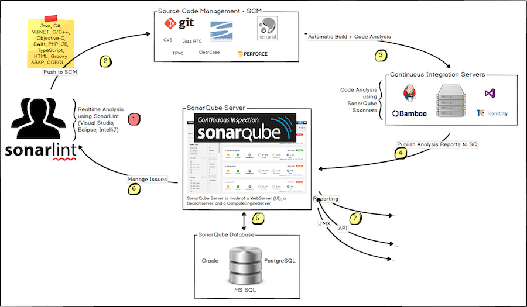
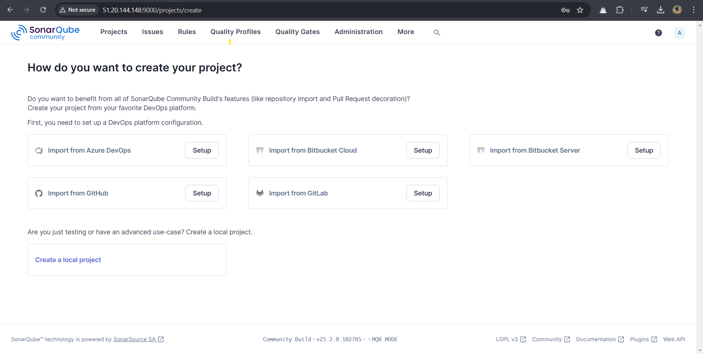

# SonarQube Setup Guide for Jenkins Integration 🚀

## 📋 Overview
SonarQube is a powerful static code analysis tool that helps improve code quality by detecting bugs, vulnerabilities, and code smells. This guide provides step-by-step instructions for setting up SonarQube and integrating it with Jenkins for continuous inspection of code quality.

---

## 🏛️ Architecture Diagram



---

## 📌 Prerequisites

### ✅ System Requirements
- **SonarQube Server**: A dedicated machine (Ubuntu 22.04 recommended)
- **Jenkins Server**: Installed and running on a separate machine
- **Database**: PostgreSQL (recommended for production)
- **4GB RAM (minimum required)**
- **Java**: JDK 17+ required for SonarQube 9.x and later
- **Maven & Gradle**: Installed on Jenkins to run Sonar analysis
- **Sonar Scanner**: Installed on Jenkins for scanning projects

---

## 🔧 SonarQube Server Setup

### **1️⃣ Install Java 17**
```bash
sudo apt update
sudo apt install -y openjdk-17-jdk
java -version
```

### **2️⃣ Install PostgreSQL (Recommended for Production)**
```bash
sudo apt update
sudo apt install -y postgresql postgresql-contrib
sudo systemctl start postgresql
sudo systemctl enable postgresql
```

#### **Create SonarQube Database and User**
**Note:** Execute these commands **one by one** instead of copying and pasting them all at once.
```bash
sudo -u postgres psql
CREATE DATABASE sonarqube;
CREATE USER sonar WITH ENCRYPTED PASSWORD 'sonar_password';
GRANT ALL PRIVILEGES ON DATABASE sonarqube TO sonar;
ALTER USER sonar WITH SUPERUSER;
\q
```

### **4️⃣ Download and Install SonarQube**
```bash
cd /opt
sudo curl -O https://binaries.sonarsource.com/Distribution/sonarqube/sonarqube-25.2.0.102705.zip
sudo apt install unzip
sudo unzip sonarqube-25.2.0.102705.zip
sudo mv sonarqube-25.2.0.102705/ sonarqube
```

### **5️⃣ Configure SonarQube**
Edit the **SonarQube configuration file**:
```bash
sudo nano /opt/sonarqube/conf/sonar.properties
```
Add the following lines:
```ini
sonar.jdbc.username=sonar
sonar.jdbc.password=sonar_password
sonar.jdbc.url=jdbc:postgresql://localhost:5432/sonarqube
sonar.web.host=0.0.0.0
sonar.web.port=9000
```
Save and exit (`CTRL+X`, then `Y`, then `Enter`).

### **6️⃣ Create a Dedicated User for SonarQube**
```bash
sudo useradd -m -d /opt/sonarqube sonar
sudo chown -R sonar:sonar /opt/sonarqube
```

### **7️⃣ Configure SonarQube as a Systemd Service**
Create the SonarQube service file:
```bash
sudo nano /etc/systemd/system/sonarqube.service
```

Paste the following content:
```ini
[Unit]
Description=SonarQube service
After=syslog.target network.target

[Service]
Type=forking
ExecStart=/opt/sonarqube/bin/linux-x86-64/sonar.sh start
ExecStop=/opt/sonarqube/bin/linux-x86-64/sonar.sh stop
User=sonar
Group=sonar
Restart=on-failure
LimitNOFILE=65536
LimitNPROC=4096

[Install]
WantedBy=multi-user.target
```
Save and exit (`CTRL+X`, then `Y`, then `Enter`).

### **8️⃣ Start and Enable SonarQube Service**
```bash
sudo systemctl daemon-reload
sudo systemctl enable sonarqube
sudo systemctl start sonarqube
sudo systemctl status sonarqube
```

### **9️⃣ Restart PostgreSQL and SonarQube (If Required)**
If SonarQube does not start correctly, restart PostgreSQL and SonarQube:
```bash
sudo systemctl restart postgresql
sudo systemctl restart sonarqube
```

---

## 🌟 Access SonarQube
- Open a web browser and go to: `http://<YOUR_SERVER_IP>:9000`
- Default login credentials:
  - **Username:** admin
  - **Password:** admin

**Change the default password after logging in.**



---

## 🏁 Final Verification
- SonarQube should be running and accessible at `http://<server-ip>:9000`
- PostgreSQL should be running without issues
- Logs can be checked using:
```bash
sudo cat /opt/sonarqube/logs/sonar.log
```

## 🔧 Jenkins Integration with SonarQube

### **1️⃣ Install Required Plugins in Jenkins**
- Navigate to **Manage Jenkins** → **Manage Plugins** → **Available**
- Search and install:
  - **SonarQube Scanner Plugin**
  - **Quality Gates Plugin**

### **2️⃣ Configure SonarQube in Jenkins**
- Go to **Manage Jenkins** → **Configure System**
- Find **SonarQube Servers** section → Click **Add SonarQube**
- Enter the following details:
  - **Name**: `SonarQube`
  - **Server URL**: `http://<SONARQUBE_SERVER_IP>:9000`
  - **Authentication Token**: Generate from SonarQube UI → `Administration > Security > Tokens`
  - **Save** the configuration.

### **3️⃣ Install and Configure Sonar Scanner in Jenkins Slave Machine**
To install Sonar Scanner on the server:
```bash
cd /opt
sudo curl -O https://binaries.sonarsource.com/Distribution/sonar-scanner-cli/sonar-scanner-cli-6.2.1.4610-linux-x64.zip
sudo unzip sonar-scanner-cli-6.2.1.4610-linux-x64.zip
sudo mv sonar-scanner-6.2.1.4610-linux-x64/ sonar-scanner
```

### **Set Up Environment Variables**
```bash
echo 'export SONAR_SCANNER_HOME="/opt/sonar-scanner"' | sudo tee -a /etc/profile
echo 'export PATH="$SONAR_SCANNER_HOME/bin:$PATH"' | sudo tee -a /etc/profile
source /etc/profile
```

Verify the installation:
```bash
sonar-scanner --version
```

---


## 🔥 Running SonarQube Analysis in Jenkins Pipeline

### **1️⃣ Create a Jenkins Pipeline Job**
- Go to **Jenkins Dashboard** → **New Item** → **Pipeline**
- Choose **Pipeline** and click **OK**

### **2️⃣ Add SonarQube Analysis to Jenkinsfile**
- **Build Now**.
- SonarQube analysis results will be available in the **SonarQube Dashboard**.

---

## 🏁 Final Verification

### ✅ **SonarQube Server**
- UI is accessible at `http://<SONARQUBE_SERVER_IP>:9000`
- SonarQube is running and projects are scanned successfully.

### ✅ **Jenkins Integration**
- SonarQube plugin is installed in Jenkins.
- SonarQube scanner runs successfully in the Jenkins pipeline.
- Quality Gate results are properly integrated.

---

## 📄 Additional Documentation
- **[SonarQube Official Docs](https://docs.sonarqube.org/latest/)**
- **[Jenkins Integration with SonarQube](https://docs.sonarsource.com/sonarqube-server/9.8/analyzing-source-code/ci-integration/jenkins-integration/)**

---

## 📧 Contact  
📧 **Email**: [sudarshangawande98@gmail.com](mailto:sudarshangawande98@gmail.com)  
🔗 **GitHub**: [Sudarshan Gawande](https://github.com/sudarshan-gawande)  
🌐 **Portfolio**: [sudarshangawande.com](https://sudarshangawande.com)  
💼 **LinkedIn**: [Sudarshan Gawande](https://www.linkedin.com/in/sudarshan-gawande/)  

---

## 📄 License
This project is licensed under the **MIT License**. See the `LICENSE` file for details.
