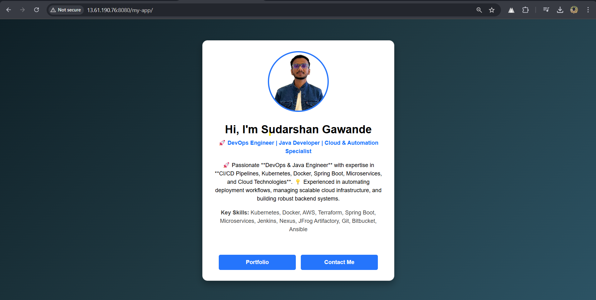

# Tomcat Setup Guide for Amazon EC2 🚀

## 📋 Overview
Apache Tomcat is an open-source web server and servlet container used to deploy Java web applications. This guide provides step-by-step instructions to install and configure Tomcat on an **Amazon EC2** instance.

---

## 📌 Prerequisites

### ✅ System Requirements
- **Amazon EC2 Instance** (Ubuntu 22.04 recommended)
- **Minimum 2GB RAM (Recommended 4GB+)**
- **Java 17 installed**
- **A non-root user with sudo privileges**
- **Security Group allowing HTTP (80), HTTPS (443), and Tomcat ports (8080)**

---

## 🔧 Install Java 17
```bash
sudo apt update
sudo apt install -y openjdk-17-jdk
java -version
```

---

## 🔥 Install Tomcat 9

### **1️⃣ Download and Extract Tomcat**

```bash
cd /opt
sudo curl -O https://dlcdn.apache.org/tomcat/tomcat-9/v9.0.99/bin/apache-tomcat-9.0.99.tar.gz
sudo tar -xvf apache-tomcat-9.0.99.tar.gz
sudo mv apache-tomcat-9.0.99/ tomcat
```

---

## 🔧 Configure Tomcat

### **2️⃣ Create a Dedicated Tomcat User**
```bash
sudo useradd -m -d /opt/tomcat -U -s /bin/false tomcat
sudo chown -R tomcat:tomcat /opt/tomcat
```

### **3️⃣ Configure Environment Variables**
```bash
echo 'export CATALINA_HOME="/opt/tomcat"' | sudo tee -a /etc/profile
echo 'export PATH="$CATALINA_HOME/bin:$PATH"' | sudo tee -a /etc/profile
source /etc/profile
```

### **4️⃣ Configure Tomcat Users**

Edit the Tomcat users configuration file:
```bash
sudo nano /opt/tomcat/conf/tomcat-users.xml
```

Add the following inside `<tomcat-users>`:

```xml
<role rolename="manager-gui"/>
<role rolename="admin-gui"/>
<role rolename="admin-script"/>
<role rolename="manager-script"/>
<user username="admin" password="admin" roles="manager-gui,admin-gui,admin-script,manager-script"/>
```

---

## ✅ Enable Server Status, Manager App, and Host Manager

Edit the `context.xml` files:

```bash
sudo nano /opt/tomcat/webapps/manager/META-INF/context.xml
```

Comment out or remove the following lines:
```xml
<Context antiResourceLocking="false" privileged="true" >
  <!-- <Valve className="org.apache.catalina.valves.RemoteAddrValve"
         allow="127\d+\.\d+\.\d+\.\d+|::1|0:0:0:0:0:0:0:1" /> -->
</Context>
```

Repeat the same for Host Manager:

```bash
sudo nano /opt/tomcat/webapps/host-manager/META-INF/context.xml
```

Remove or comment out the `<Valve>` entry.

---

## 🎯 Configure Tomcat as a Systemd Service

Create a systemd service file:
```bash
sudo nano /etc/systemd/system/tomcat.service
```

Add the following:

```ini
[Unit]
Description=Apache Tomcat Web Application Container
After=network.target

[Service]
Type=forking
User=tomcat
Group=tomcat
Environment="JAVA_HOME=/usr/lib/jvm/java-17-openjdk-amd64"
Environment="CATALINA_HOME=/opt/tomcat"
ExecStart=/opt/tomcat/bin/startup.sh
ExecStop=/opt/tomcat/bin/shutdown.sh
Restart=on-failure

[Install]
WantedBy=multi-user.target
```

Save and exit (`CTRL+X`, then `Y`, then `Enter`).

---

## 🔄 Start and Enable Tomcat Service

```bash
sudo systemctl daemon-reload
sudo systemctl enable tomcat
sudo systemctl start tomcat
sudo systemctl status tomcat
```

---

## 🌐 Access Tomcat Web UI

Once Tomcat is running, access it via:

```
http://<EC2-PUBLIC-IP>:8080
```


- **Server Status**: `http://<EC2-PUBLIC-IP>:8080/manager/status`
- **Manager App**: `http://<EC2-PUBLIC-IP>:8080/manager`
- **Host Manager**: `http://<EC2-PUBLIC-IP>:8080/host-manager`

Use the **admin credentials** set in `tomcat-users.xml`.

---
## 🔧 Configure Tomcat in Jenkins

### 1️⃣ Install Tomcat Deployment Plugin
- Go to **Manage Jenkins** → **Manage Plugins** → **Available Plugins**
- Search for **Deploy to container Plugin** and install it.
- Restart Jenkins if required.

### 2️⃣ Jenkins Integration for Tomcat Deployment
- Enter the following details:
  - **Manager credentials:** Provide the **admin username and password** configured in `tomcat-users.xml`.

  


### 3️⃣ Deploy to Tomcat using Jenkins Pipeline


### 4️⃣ Test Deployment
- Once the pipeline runs successfully, access the deployed application at:
  ```
  http://<TOMCAT_SERVER_IP>:8080/<APP_NAME>
  ```
  

---

## 📄 Additional Documentation

- **[Apache Tomcat Official Docs](https://tomcat.apache.org/)**
- **[AWS EC2 Setup Guide](https://docs.aws.amazon.com/ec2/)**
- **[WAR File Deployment in Tomcat](https://tomcat.apache.org/tomcat-10.0-doc/deployer-howto.html)**

---

## 💎 Contact
📧 **Email**: [sudarshangawande98@gmail.com](mailto:sudarshangawande98@gmail.com)  
📎 **GitHub**: [Sudarshan Gawande](https://github.com/sudarshangawande98)

---

## 📄 License
This project is licensed under the **MIT License**. See the `LICENSE` file for details.
